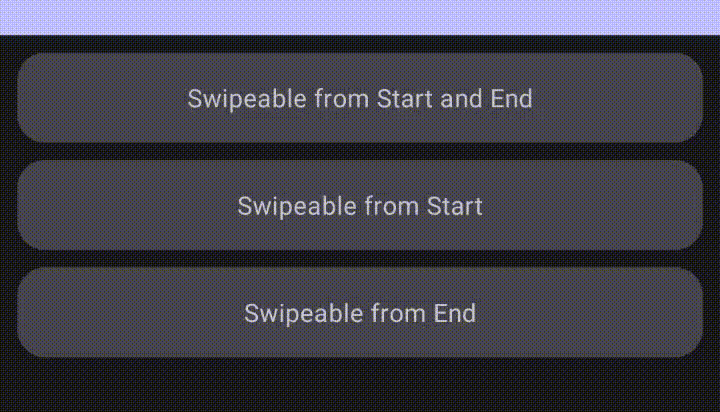

# SwipeableCard

SwipeableCard is an easy-to-use Jetpack Compose library that allows you to implement swipeable cards in your app with minimal effort.

With SwipeableCard, you can create cards with multiple action buttons hidden behind the card's content:



## How to Use

### Adding SwipeableCard to your project

<details open>
<summary>Kotlin</summary>

```kotlin
dependencies {
    implementation("dev.obvionaoe.compose:swipeable-card:<version>")
}
```

</details>

<details>
<summary>Groovy</summary>

```groovy
dependencies {
    implementation 'dev.obvionaoe.compose:swipeable-card:<version>'
}
```

</details>

### Usage

You can find sample usage in the [sample app in this repository](sample).

## Compatibility

- Requires Android API level 21 and above
- Compatible with Jetpack Compose BOM 2023.06.01

## Contributing

Contributions to SwipeableCard are welcome! If you find any bugs, have feature requests, or want to contribute in any way, please open an issue or submit a pull request.

## License

SwipeableCard is licensed under the MIT License. See the [LICENSE](LICENSE) file for details.
